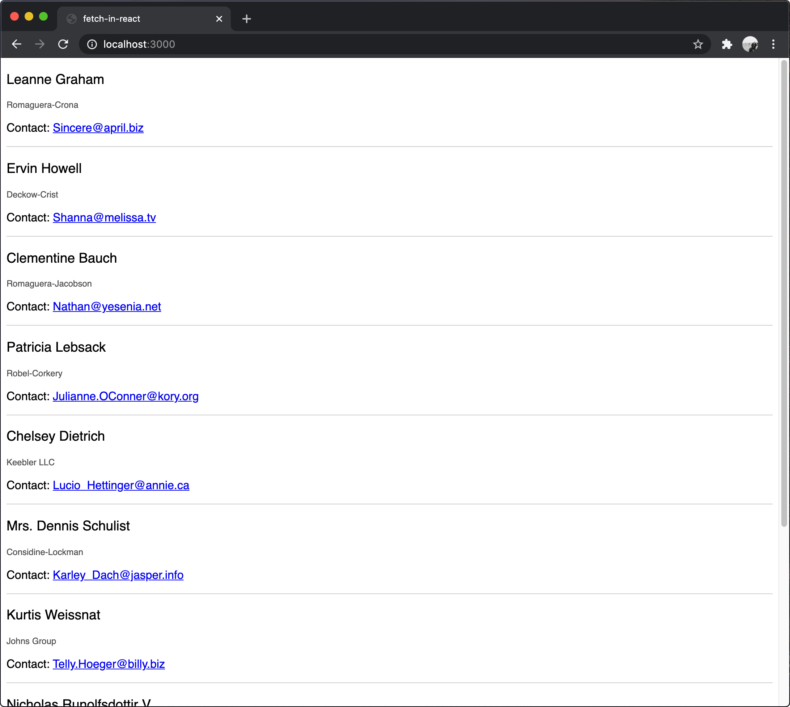

#      fetch-in-react

Sending HTTP requests to a server from a React app.

## Before You Begin

Be sure to check out a new branch from `main` for this exercise. Detailed instructions can be found [**here**](../../guides/starting-an-exercise).

## Quiz

After completing this exercise, you should be able to discuss or answer the following questions:

- When does React call a component's `componentDidMount` method?
- Name three React.Component lifecycle methods.
- How do you pass data to a child component?

## Exercise

**For this exercise's commands to work properly, your terminal needs to be within the exercise's directory.** In your terminal, change directories with the `cd` command. This will change which directory your future commands are executed in.

```bash
cd name-of-exercise
```

**⚠️ Your terminal prompt should look like this with the name of the exercise at the end of the path as well as the branch name in `()` parenthesis. ⚠️**

#### Yes ✅

```shell
/workspaces/c000-code-solutions/name-of-exercise (name-of-exercise) λ
```

#### No ❌

```shell
/workspaces/c000-code-solutions (name-of-exercise) λ
```

1. Review the documentation about Effects in [Synchronizing with Effects](https://beta.reactjs.org/learn/synchronizing-with-effects) in and [useEffect](https://beta.reactjs.org/reference/react/useEffect) hook.
1. Review how to [use `fetch`](https://developer.mozilla.org/en-US/docs/Web/API/Fetch_API/Using_Fetch) in the MDN Web Docs.
1. Bookmark React's [lifecycle diagram](https://wavez.github.io/react-hooks-lifecycle/).
1. Read through all of the files provided with this exercise, including `webpack.config.js` and `package.json`.
1. Run `npm install` to download all dependencies listed in `package.json` to `node_modules`.
1. Run `npm run dev` to start `webpack-dev-server`, then visit `http://localhost:3000` in your web browser. The browser should automatically refresh when you change any source code.
1. Complete the implementation of `src/app.jsx` to send a `GET` request to `https://jsonplaceholder.typicode.com/users` for a list of ten users after `App` has mounted. You don't have to modify any other code.

<p align="middle">
  
</p>

### Finish

**For `git` to work properly, your terminal needs to be within the root of your local repository.** You have been executing commands in your exercise directory, but it's time to return "up" one level. In your terminal, change directories with the `cd` command as shown in the example below. This will change which directory your future commands are executed in.

**`..` means "parent directory".**

```bash
cd ..
```

#### Yes ✅

```shell
/workspaces/c000-code-solutions (name-of-exercise) λ
```

#### No ❌

```shell
/workspaces/c000-code-solutions/name-of-exercise (name-of-exercise) λ
```

## Submitting Your Solution

When your solution is complete, submit a Pull Request on GitHub. Detailed instructions can be found [**here**](../../guides/submitting-your-solution).
